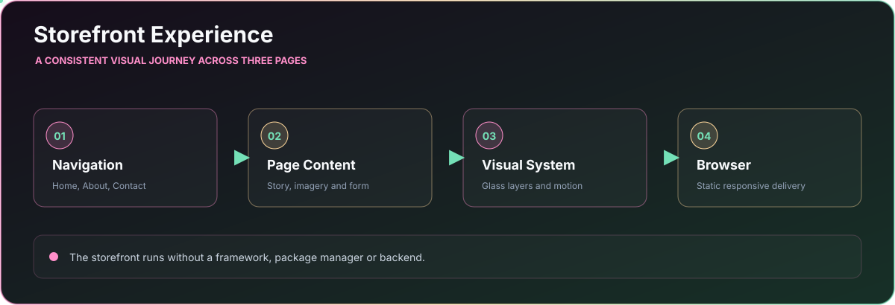

<p align="center">
  
</p>

<p align="center">
  <a href="https://itaygoldenberg.github.io/FlowerStore/"></a>
  <a href="https://github.com/itaygoldenberg/FlowerStore"></a>
  <a href="https://www.linkedin.com/in/itay-goldenberg/"></a>
</p>

<p align="center">
  <a href="#overview">Overview</a>&nbsp;&middot;&nbsp;
  <a href="#features">Features</a>&nbsp;&middot;&nbsp;
  <a href="#workflow">Workflow</a>&nbsp;&middot;&nbsp;
  <a href="#technology">Technology</a>&nbsp;&middot;&nbsp;
  <a href="#running-locally">Local setup</a>
</p>

> [!NOTE]
> A static storefront project focused on visual storytelling, navigation and a simple contact journey.

## Overview

FlowerStore is a small multi-page storefront concept for a local flower shop. It combines immersive floral imagery, glass-like surfaces and consistent navigation across Home, About and Contact pages.

The project demonstrates how a static website can still feel expressive and cohesive through strong visual direction and lightweight browser enhancements.

<table><tr><td align="center" width="25%"><strong>3</strong><br /><sub>site pages</sub></td><td align="center" width="25%"><strong>GLASS</strong><br /><sub>visual system</sub></td><td align="center" width="25%"><strong>FORM</strong><br /><sub>contact path</sub></td><td align="center" width="25%"><strong>ZERO</strong><br /><sub>dependencies</sub></td></tr></table>

| Project detail | Implementation |
|---|---|
| Home | Store introduction and floral offering |
| About | Shop story and supporting imagery |
| Contact | Focused name-and-email contact form |
| Runtime | Static browser application with no build step |

## Contents

- [Overview](#overview)
- [Features](#features)
- [Workflow](#workflow)
- [Technology](#technology)
- [Project structure](#project-structure)
- [Running locally](#running-locally)
- [Operational notes](#operational-notes)
- [Author](#author)

## Features

### Immersive presentation

Layered imagery, soft floral lighting and glass-like surfaces create a distinct boutique identity while preserving readable page content.

### Multi-page navigation

Home, About and Contact pages share one visual system and predictable navigation model.

### Lightweight enhancement

A small JavaScript behavior updates the browser title with local time. The rest of the experience remains dependency-free and easy to host.

## Workflow

<p align="center">
  
</p>

## Technology

<p align="center">
  
</p>

| Technology | Role |
|---|---|
| HTML5 | Page structure, navigation and contact form |
| CSS3 | Immersive styling, glass effects and animation |
| JavaScript | Lightweight dynamic title enhancement |
| GitHub Pages | Static public deployment |

## Project structure

```text
FlowerStore/
|-- index.html        Home page
|-- about.html        About page
|-- contact-us.html   Contact page
|-- style.css         Shared visual system
|-- main.js           Browser-title enhancement
|-- images/           Store imagery
|-- docs/             README-only visual assets
|-- LICENSE           Project license
`-- README.md         Project documentation
```

## Running locally

```bash
git clone https://github.com/itaygoldenberg/FlowerStore.git
cd FlowerStore
```

Open `index.html` directly or serve the directory with VS Code Live Server.

## Operational notes

- The contact form is a frontend demonstration and does not submit to a backend service.
- Remote background imagery requires an internet connection.

## Author

<p align="center">
  <strong>Itay Goldenberg</strong><br />
  Full Stack Developer Student
</p>

<p align="center">
  <a href="https://github.com/itaygoldenberg"></a>
  <a href="https://www.linkedin.com/in/itay-goldenberg/"></a>
</p>
